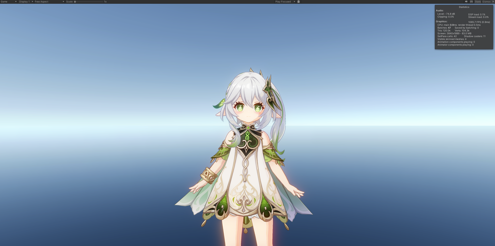

# UnityToyShaders
Practice/Learning-Purpose Unity Toy Shaders 

## NPR

With URP

## GPU RTWeekend via Unity Shader

GPU Ray Tracing In One Weekend with Unity Shaders without URP.

To check results, must set “Project Settings/Graphics/Scriptable Render Pipeline Settings” to “None” and “Project Settings/Graphics/URP Global Settings“ to “None”, then hit play button to see Ray Tracing results.

